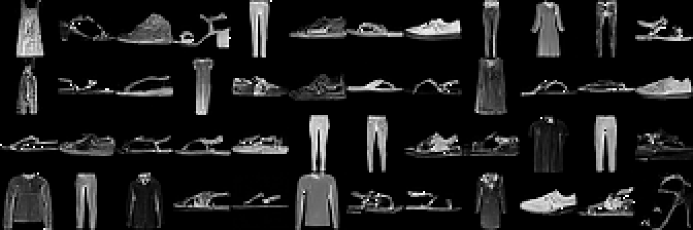

# DiffuMon

Basic Denoising Diffusion Probabilistic Model image generator implemented in PyTorch.

Developed as an educational project, with the aim of having a simpler PyTorch implementation and development setup than other DDPM implementations available. Small and lean enough to train on a commodity GPU (in this case my Geforce 4070 Ti).

The basic idea is to train a model to learn how to denoise images. Images are generated by using this trained model to iteratively remove noise from a random noise image until a coherent image forms.

## Example Generations



*Fashion MNIST sample generations*


## Getting started

## Setting up environment

This repo uses [`rye`](https://rye.astral.sh/guide/installation/) as the package/environment manager. Make sure to install it before proceeding.

The following command will install packages and setup a virtual environment

```bash
# Install packages
rye sync

# Activate virtual enviornment
. .venv/bin/activate
```


## Access the entrypoint

Once installed, the model can be trained and used via the `diffumon` command

```bash
diffumon --help
```

## Train a model

```bash
diffumon train --help
```

### Train a fashion MNIST model

```bash
diffumon train --preloaded fashion_mnist --num-epochs 100 --checkpoint-path checkpoints/fashion_mnist_100_epochs.pth
```

### Train a Pokemon Generative Model on the 11k Pokemon dataset (downscaled to 32x32)

```bash
diffumon train --preloaded pokemon_11k --num-epochs 2048 --img-dim 32 --checkpoint-path checkpoints/pokemon_11k_2048_epochs_32dim.pth
```

## Generate samples

```bash
diffumon sample --help
```

### Generate samples from the trained fashion MNIST model

```bash
diffumon sample --checkpoint-path checkpoints/fashion_mnist_100_epochs.pth --num-samples 32 --num-channels 1 --img-dim 28 --output-dir samples/fashion_mnist_100_epochs
```

### Generate samples from the trained Pokemon Generative Model

```bash
diffumon sample --checkpoint-path checkpoints/pokemon_11k_2048_epochs_32dim.pth --num-samples 32 --num-channels 3 --img-dim 32 --output-dir samples/pokemon_11k_2048_epochs_32dim
```

## Useful resources

* [Denoising Diffusion Probabilistic Models](https://arxiv.org/abs/2006.11239) - The original paper by Ho et al. (2020)
  * [diffusion on github](https://github.com/hojonathanho/diffusion) - The official codebase by the authors.
* [Improving Denoise Diffusion Probabilistic Models](https://arxiv.org/abs/2102.09672) - Improved methodology by Nichol et al. (2021)
* [What are Diffusion Models - By Lilian Weng](https://lilianweng.github.io/posts/2021-07-11-diffusion-models/) - Math heavy blog post explaining the concept.
* [Tutorial on Diffusion Models for Imaging and Vision](https://arxiv.org/pdf/2403.18103) - Tutorial by Stanley Chan which succinctly explains the math quite well.
* [The Annotated Diffusion](https://huggingface.co/blog/annotated-diffusion) - Basic tutorial for diffusion which goes off lucidrain's PyTorch implementation. This was the most utilized reference for this project!
* [*lucidrains* denoising-diffusion-pytorch](https://github.com/lucidrains/denoising-diffusion-pytorch/tree/main) - Ports Jonathan Ho's original code to PyTorch along with many of the original implementation's quirks. This was used as the primary code reference for this project.

## Developer notes

`black`, `ruff`, `isort`, and `pre-commit` should come as preinstalled dev developer packages in the virtual environment.

It's strongly recommended to install pre-commit hooks to ensure code consistency and quality which will automatically run formatters (but not linters) before each commit.

```bash
pre-commit install
```

### Jupyter notebooks

There are also example notebook(s) in the `notebooks/` directory.

Make sure to install the `diffumon` kernel in Jupyter to run the notebooks.

```bash
python -m ipykernel install --user --name diffumon --display-name "Python Diffumon"
```